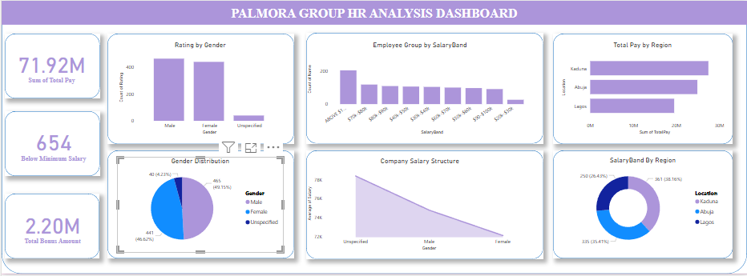

# DSA Data Analysis Capstone Project 
A collection of data analysis projects using Excel, Power BI, and MySQL. Includes data cleaning, visualization, and insights generation to demonstrate analytical skills and business understanding.

## Palmora Group HR Analysis
This project presents a comprehensive HR analysis for the Palmora Group, using Power BI for interactive dashboards and data-driven insights. It highlights key HR metrics such as gender distribution, salary structure, regulatory compliance, and total compensation.

## Tools & Technologies Used
   - Power BI
   - Power Query (Data Cleaning & Transformation)
   -  DAX (Data Modeling & Calculations)
   - Data Visualization

## Project Overview
The dashboard answers critical HR questions and supports data-driven decision-making. Below are the key analyses performed: 

### Key Insights & Case Questions Addressed:
 1. Gender Distribution Analysis
      - Visualized organization-wide gender breakdown
      - Filtered by Region and Department

  2. Employee Rating by Gender
     - Compared performance ratings across male, female, and unspecified genders
      
  3. Company Salary Structure
     - Analyzed salary distribution across genders
     - Identified presence of gender pay gaps
     - Highlighted specific regions and departments needing attention
       
  4. Regulatory Salary Compliance Check
     - Verified adherence to the $90,000 minimum wage requirement
     - Identified 654 employees earning below this threshold
     - Displayed pay distribution in $10,000 bands by region

 
  5. Bonus & Total Compensation Calculation
     - Calculated individual bonuses
     - Computed total pay = Salary + Bonus
     - Analyzed total compensation by region and company-wide

### 📸 Dashboard Preview

